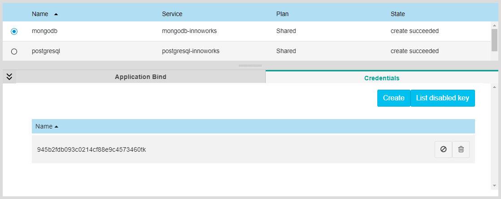
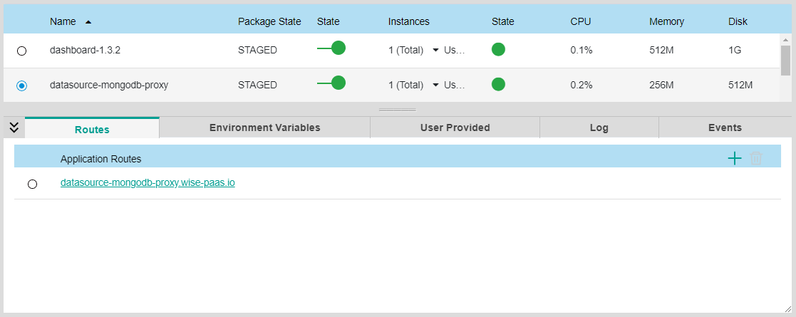
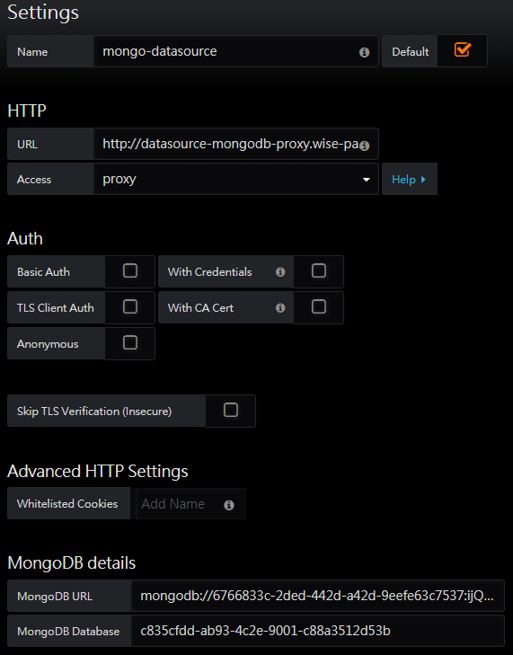
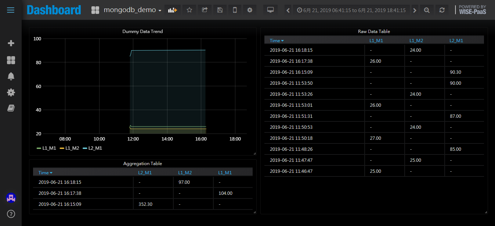
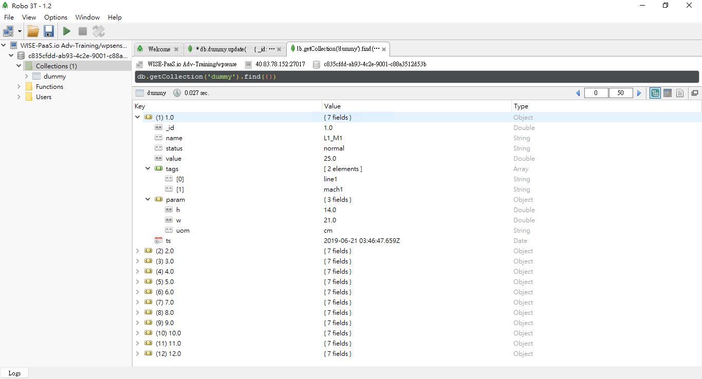
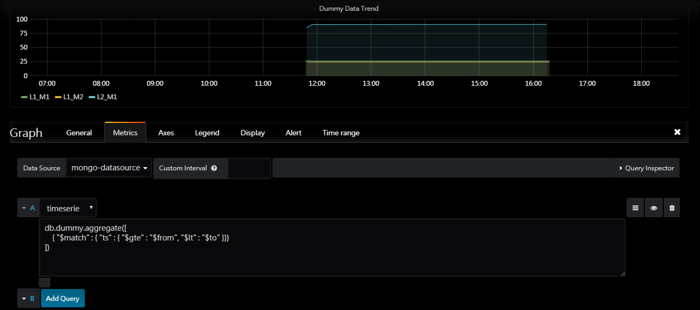
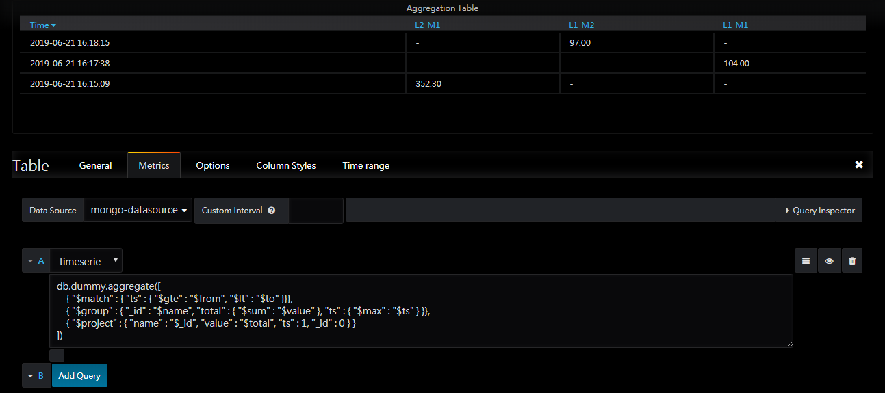

# MongoDB Datasource Usage Example for WISE-PaaS/Dashboard

## Features
Allows MongoDB to be used as a data source for Grafana by providing a proxy to convert the Grafana Data source [API](http://docs.grafana.org/plugins/developing/datasources/) into MongoDB aggregation queries.

Credits go to the project at https://github.com/JamesOsgood/mongodb-grafana

## Requirements

* **Grafana** > 3.x.x
* **MongoDB** > 3.4.x
* **WISE-PaaS/EnSaaS account**
* **WISE-PaaS/Dashboard** > 1.3.x

## Installation

### Install the Grafana plugin components

* WISE-PaaS/Dashboard already included this MongoDB datasource plugin in the distribution, so there's no need to install the datasource plugin.

### Install and Start the MongoDB proxy server

* Simply do `cf push` at the root directory of the project where the `manifest.yml` file is located at.

## Examples

First, we need to create a credential key for our MongoDB service instance on WISE-PaaS : 



Create a new data source of type MongoDB as shown below. Please use the right credential information and proxy server URL for your environment :

You may find the URL of your proxy server on the management portal, inside the application information panel.



* **MongoDB URL** - `mongodb://<username>:<password>@40.83.78.152:27017/<database_name>`
* **Example Proxy Server URL** - `http://datasource-mongodb-proxy.wise-paas.io/`



Then save the data source

#### Example 1 - Simple aggregate to rename fields

Import the dashboard in `examples\mongodb_demo.json`



This should show a graph of data values from a dummy data set, which has the document format like below : 



Clicking on the title of the graph allows you to see the aggregation query being run against the data source



The query here is

```javascript
db.dummy.aggregate([
    { "$match" : { "ts" : { "$gte" : "$from", "$lt" : "$to" }}}
])
 ```

 The API is expecting back documents with the following fields

 * `name` - Name of the series ( will be displayed on the graph)
 * `value` - The float value of the point
 * `ts` - The time of the point as a BSON date

 These documents are then converted into the [Grafana API](http://docs.grafana.org/plugins/developing/datasources/)

`$from` and `$to` are expanded by the plugin as BSON dates based on the range settings on the UI.

#### Example 2 - Using a Tabel Panel



Table panels are now supported with queries of the form

```javascript
db.dummy.aggregate([
    { "$match" : { "ts" : { "$gte" : "$from", "$lt" : "$to" }}},
    { "$group" : { "_id" : "$name", "total" : { "$sum" : "$value" }, "ts" : { "$max" : "$ts" } }},
    { "$project" : { "name" : "$_id", "value" : "$total", "ts" : 1, "_id" : 0 } }
])
```    


